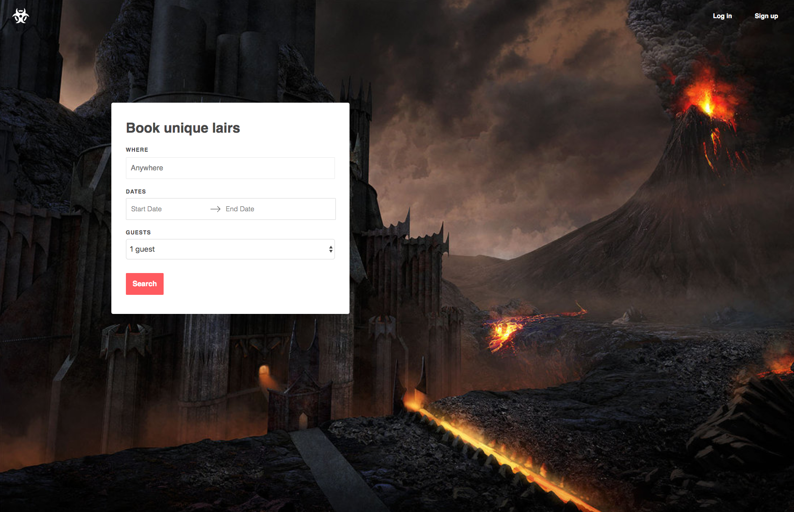
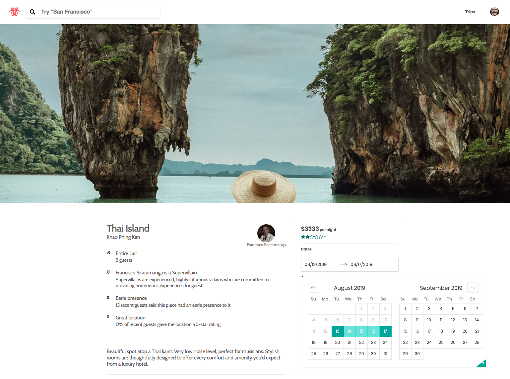
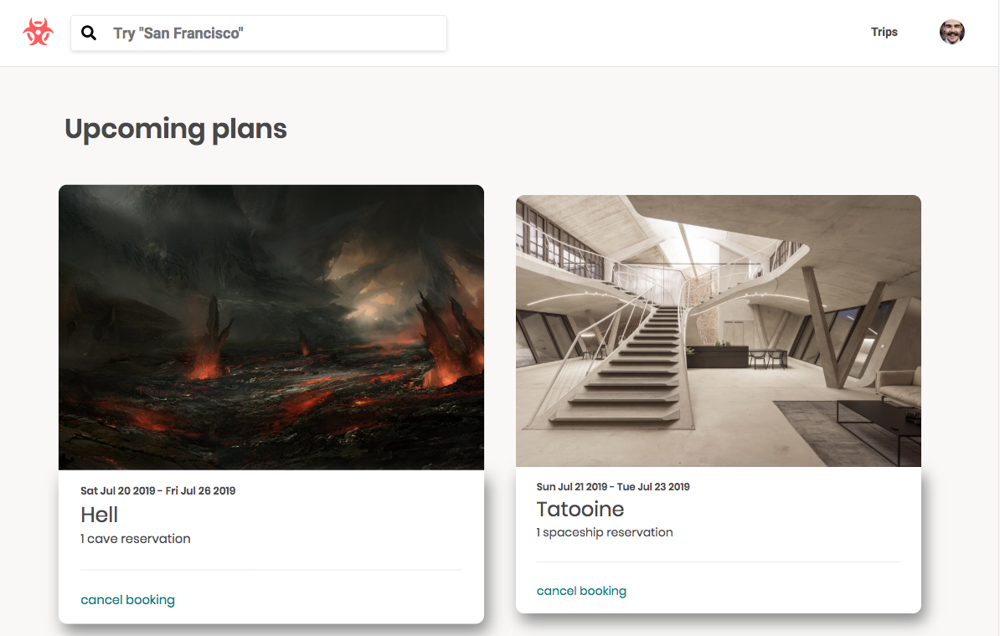

# LairBnB

## Overview
[Live Link](https://villain-lairbnb.herokuapp.com/#/)

## Background and Overview
LairBnB is a full stack clone of AirBnB that connects villains who want to rent out their evil lairs to everyday citizens seeking something less mundane for their vacation homes.

## Technologies

* **Backend:** MongoDB/Express
* **Frontend:** React/Node.js
* **Hosting:** Heroku
* Google Maps API 
* BCrypt for user authentication
* AWS S3 for storage of images
* React-Dates for our calendar 

## Preview

Splash page allows to search for lairs without logging in

Lairs listings on the left dynamically adjust depending on the pins appearing on the map

Search lairs by location, categories (castle, spaceship, etc..). If you're feeling fancy, explore the evil luxury lairs

The lair show page allows a user to book a lair with a calendar as well as see previous guests reviews

Peek at your upcoming trips with an option to cancel

## Functionality and MVP
* User authentication: sign up and log in
* Publicly viewable listing of lairs with index and show pages
* Users that are logged in are able to make, cancel, and edit their bookings
* Browse amenities each lair offers
* Create and read user reviews
* Aggregate user review scores
* Browse by location on Google Maps
* Categories for splash screen - beach, international etc.

## Developers

* [April Graves](https://github.com/AprilHGraves)
* [Charles Mancuso](https://github.com/unionky)
* [Christie Brandao](https://github.com/cbrandao18)
* [Zach Oliver](https://github.com/Numbericons/)

